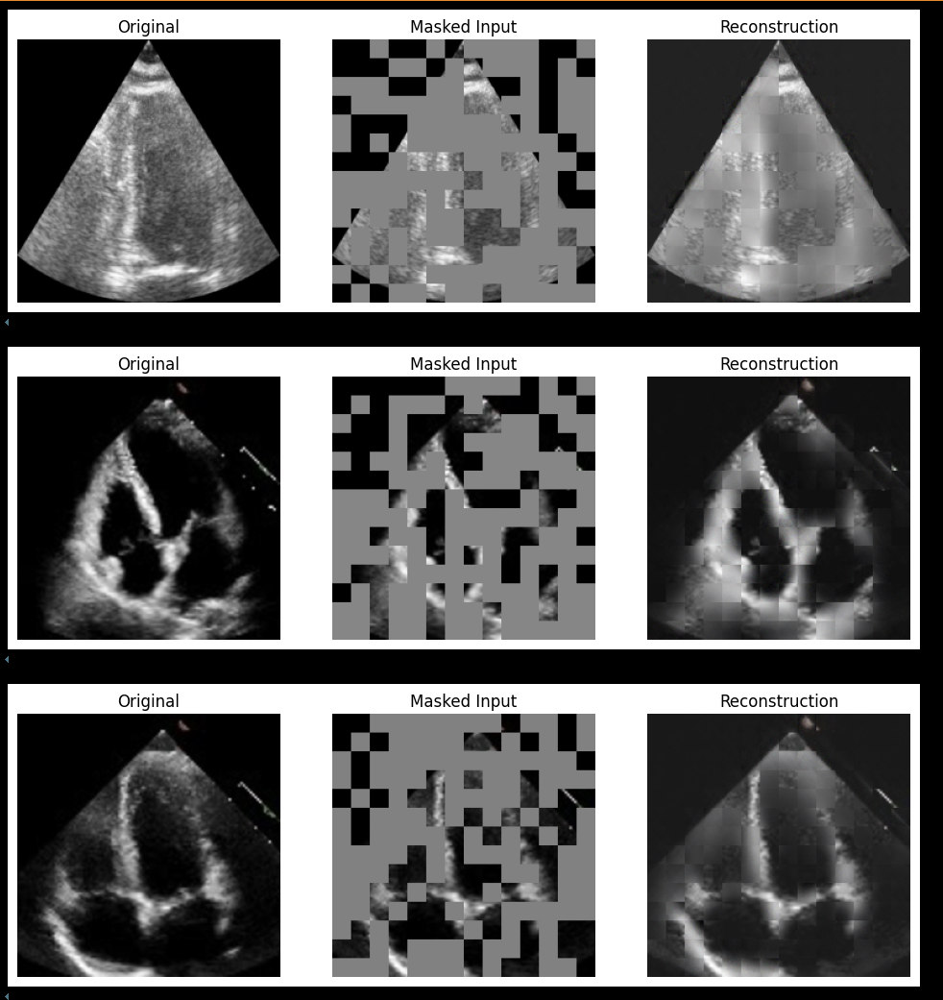
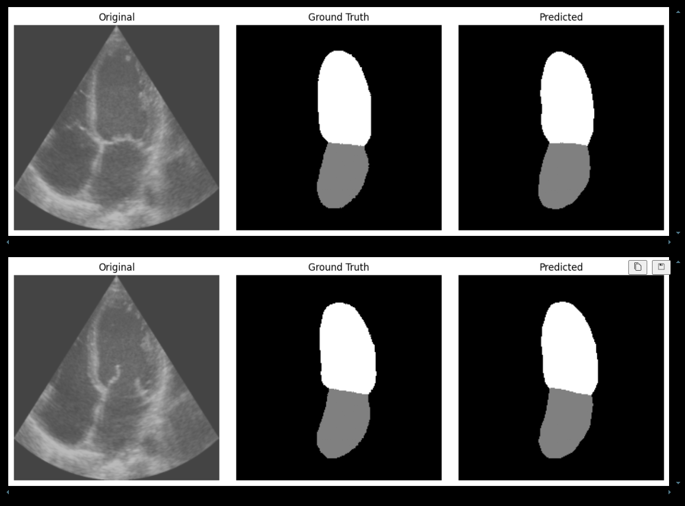

# 🫀 Cardiac Segmentation using UNETR with Pretrained MAE

This project demonstrates a powerful two-stage pipeline for medical image segmentation using:
- **Masked Autoencoders (MAE)** for self-supervised pretraining on unlabeled cardiac ultrasound images
- **UNETR** (UNet with Transformer Encoder) for accurate segmentation of cardiac chambers (LV, LA, RV, RA) from 2D echocardiographic data

---

## 🚀 Project Highlights

- **Custom MAE Pretraining** on EchoNet-style video frames
- **Transfer Learning**: MAE encoder weights transferred into UNETR encoder
- **Multi-class Segmentation**: Supports 2 or 4 cardiac structures
- **Mixed Input Support**: Works with both video files (`.avi`) and still images (`.jpg`)
- **Evaluation**: Dice and IoU metrics, worst-case visualization

---

## 📁 Project Structure
```
├── .gitignore
├── README.md
├── eval_unetr.py
├── notebooks
    ├── EchoNet.ipynb
    ├── MAE.ipynb
    └── UNETR.ipynb
├── src
    ├── MAE_model.py
    ├── UNETR.py
    ├── datasets.py
    ├── loader.py
    ├── losses.py
    ├── mae.py
    ├── unetr_model.py
    └── utils.py
├── tests
    └── test_unetr.py
├── train_custom_MAE.py
└── train_unetr.py
```

## Examples

### MAE Pretraining

MAE learns to reconstruct missing regions in cardiac ultrasound frames:



---

### UNETR Segmentation

UNETR segments left atrium and ventricle accurately from 2D echo:




## Dependencies

- python 3.12
- requirements.txt


## 📚 References

    UNETR: Transformers for Medical Image Segmentation
    MAE: Masked Autoencoders Are Scalable Vision Learners
    EchoNet-Dynamic Dataset
    CAMUS Dataset